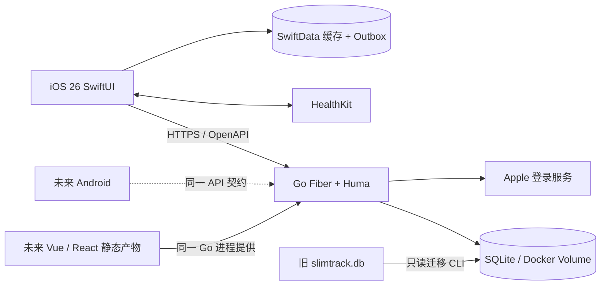

# 量迹（MeasureTrail）实施计划

> 状态：持续实施中，尚未达到发布门禁
>
> 更新日期：2026-09-07
>
> 当前目录：`/Volumes/WorkSSD/Projects/github-my/measure-trail`（已于 Phase 0 完成目录改名）
>
> 当前状态：Phase 1 已完成；Phase 2 至 Phase 4 的后端、Docker 配置、旧库只读检查/导入工具和 OpenAPI 快照已实现。独立 Docker Compose smoke 已验证镜像构建、健康检查、SQLite 命名卷重启持久化和在线备份/恢复；恢复说明已修正为将确认变量传入临时容器。后端已通过 HTTP 集成测试覆盖两个设备会话的旧版本编辑和离线新设备同日创建均返回 `409`，并可读取最新远端记录；同日并发新建也只保留一条记录而不静默覆盖，短暂 SQLite busy 会在有界退避后重试。Phase 5 至 Phase 7 的 iOS 已具备首次单位引导、认证、资料与单位设置、离线缓存、Outbox、增量拉取、版本化编辑、冲突呈现与处理、补录/编辑、趋势、导出及 HealthKit 锚点读取同步，以及明确确认后写入之后手工记录的能力；网络恢复后会自动触发同步。已有单位、记录输入、HealthKit API 映射、同步合并、Outbox 重试、服务器地址校验、旧版本编辑/离线新设备同日记录的冲突捕获与决策、网络可用性 XCTest，以及首次引导和 HTTPS 服务地址拒绝 UI 测试。Release 模拟器产物已确认打包 HealthKit 用途说明与隐私清单。GitHub Actions 已新增 macOS 26 的 iOS 测试工作流。仍需补齐跨设备端到端冲突测试与真机验证。品牌方向 B、SVG/PNG 导出和 `AppIcon.icon` 已锁定。

## 1. 已确认决策

- 产品名称：**量迹 / MeasureTrail**。
- 产品定位：中性的个人身体指标记录工具，不以“减肥”作为品牌前提。
- 仓库形态：一个 monorepo，明确区分 `backend/`、`ios/`、`web/`。
- iOS：仅支持 iOS 26，使用 SwiftUI、Swift Charts、SwiftData、HealthKit 和原生 Liquid Glass。
- 后端：参考 `ydfk/go-fiber-starter`，使用 Fiber v3、Huma、GORM、OpenAPI；当前正式数据库使用 SQLite。
- 部署：单实例 Docker Compose，SQLite 放入持久化卷；运行容器仅启动 Go，由 Go 同时提供 API 和未来 Vue/React 静态产物。
- 账号：暂不开放注册；用户名密码为主要凭证，首次启动创建可由环境变量覆盖的默认账号；已绑定身份可通过 Apple 登录。用户名和密码未来可在 Web 修改。
- 数据权威：服务端 SQLite 是跨端权威数据源；iOS SwiftData 只是离线缓存和待同步队列。
- 记录字段：日期、体重、可选腰围、可选备注；用户资料保存身高、目标体重和首选单位；BMI 动态计算。
- 分析：当前值、较上次变化、7/30/90 天变化、目标进度、周/月平均和连续记录天数。
- HealthKit：用户授权后可选读写；拒绝授权不影响手动记录。
- 单位：首次启动选择斤或公斤；中文环境默认斤；持久化使用规范整数单位，不重复保存斤和公斤。
- 数据管理：支持编辑、删除、日期筛选和 CSV 导出；**不提供 CSV 导入**。
- 旧数据：从当前 `slimtrack.db` 一次性迁移，不直接沿用旧表作为正式业务表。
- 提醒、Widget、Apple Watch、iPad 专用布局和 Web 业务实现不进入第一版。

## 2. 当前证据与基线

### 2.1 当前仓库

- 当前目录原本不是 Git 仓库，已按用户授权初始化 `main` 分支。
- 当前没有远程地址，因此初始化前不存在可以拉取的远程分支。
- 后续一旦配置远程，任何代码修改前都先执行 `git status`、`git fetch` 和安全的 `git pull --ff-only`；若无法快进则停止并处理分歧，不强制覆盖。
- `slimtrack.db` 及其 WAL/备份已通过 `.gitignore` 排除，真实健康数据不得进入 Git 历史。

### 2.2 旧 SQLite 实测结果

源文件：`slimtrack.db`

SHA-256：`e3b64b17c2ced4e2fa95ec3c81f4ea2b0bc3a427d47ddf26f7853a3998440c32`

| 检查项 | 结果 |
| --- | --- |
| 业务表 | `WeightEntries` |
| EF Core 表 | `__EFMigrationsHistory`、`__EFMigrationsLock` |
| 记录数 | 47 |
| 日期范围 | 2025-09-26 至 2025-11-18 |
| 重复日期 | 0 |
| 非法日期/时间 | 0 |
| 非正数体重/腰围 | 0 |
| 斤与公斤不一致 | 0 |
| 腰围记录 | 1 |
| 非空备注 | 8 |
| 公斤范围 | 70.40–76.12 kg |

旧表字段为 `Id`、`CreatedAt`、`Date`、`Note`、`UpdatedAt`、`WeightGongJin`、`WeightJin`、`WaistCircumference`，数值以 `TEXT` 保存，`Date` 为全局唯一。它没有用户归属，不能直接支持多账号。

## 3. 第一版范围与非目标

### 3.1 第一版必须完成

1. 完整品牌资产和 iOS 26 App Icon。
2. Docker 可部署的 Go + SQLite 后端。
3. 默认账号、用户名密码登录与修改、会话管理，以及已绑定身份的 Apple 登录。
4. 用户资料、目标、单位设置。
5. 体重/腰围/备注的新增、覆盖、编辑、删除、历史与统计。
6. iOS 登录、离线查看、离线录入、恢复联网同步与冲突处理。
7. HealthKit 可选读写及防重复同步。
8. 旧 SQLite 的只读、可审计、可重跑迁移工具。
9. CSV 导出、账号数据删除、隐私说明和 App Store 审核准备。
10. API、后端、iOS、Docker 和迁移的自动化验证。

### 3.2 明确不做

- 不实现 Web 业务页面；保留可直接接入 Vue/React 构建产物的 Docker 与 Go 静态托管边界。
- 不实现 CSV 导入、饮食、运动、照片、AI 建议、社区或订阅。
- 不实现每日提醒、Widget、Watch App 或智能体脂秤蓝牙连接。
- 不把 BMI 或趋势包装成诊断、治疗或医疗建议。
- 不允许 iOS 直接访问服务端 SQLite 文件。
- 不允许多副本后端同时写同一个 SQLite 卷。

## 4. 总体架构



关键原则：

- 所有客户端只依赖 HTTP/OpenAPI 契约，不依赖 Go 或 SQLite 的内部实现。
- 业务日期按用户所在时区的日历日期保存为 `YYYY-MM-DD`；审计时间统一保存 UTC RFC 3339。
- 服务端使用整数 `weight_g`、`waist_mm`、`height_mm`，避免浮点和双单位冗余。
- 每个用户每天最多一条身体记录，唯一约束为 `(user_id, recorded_on)`。
- iOS 本地先写缓存与 Outbox，再同步到服务器；服务器确认后清除待同步状态。
- 使用版本号做乐观并发控制，冲突返回 `409`，客户端不得静默覆盖另一设备的新数据。

## 5. 目标目录

```text
measure-trail/
├── backend/
│   ├── cmd/
│   ├── config/
│   ├── internal/
│   │   ├── api/
│   │   │   ├── auth/
│   │   │   ├── measurements/
│   │   │   ├── profile/
│   │   │   ├── statistics/
│   │   │   └── export/
│   │   ├── model/
│   │   ├── repository/
│   │   ├── service/
│   │   └── migration/
│   ├── openapi/
│   ├── pkg/
│   ├── scripts/
│   ├── data/                 # 忽略，不提交
│   ├── Dockerfile
│   ├── go.mod
│   └── go.sum
├── ios/
│   ├── MeasureTrail.xcodeproj
│   ├── MeasureTrail/
│   │   ├── App/
│   │   ├── Features/
│   │   │   ├── Authentication/
│   │   │   ├── Onboarding/
│   │   │   ├── Dashboard/
│   │   │   ├── Recording/
│   │   │   ├── History/
│   │   │   ├── Insights/
│   │   │   └── Settings/
│   │   ├── Domain/
│   │   ├── Data/
│   │   ├── Services/
│   │   ├── DesignSystem/
│   │   └── Resources/
│   ├── MeasureTrailTests/
│   └── MeasureTrailUITests/
├── web/
│   └── README.md             # 只说明未来范围
├── brand/
│   ├── concepts/
│   ├── source/
│   └── exports/
├── docs/
│   ├── plan.md
│   ├── architecture.md
│   ├── api-contract.md
│   ├── data-migration.md
│   ├── privacy.md
│   └── app-store-checklist.md
├── scripts/
│   ├── update-openapi.sh
│   ├── backup-sqlite.sh
│   └── restore-sqlite.sh
├── backups/                  # 忽略，不提交
├── docker-compose.yml
├── .env.example
├── .gitignore
├── README.md
└── README_zh.md
```

## 6. 品牌与 Logo 计划

### 6.1 品牌命题

- 名称：量迹 / MeasureTrail。
- 核心隐喻：测量形成轨迹，长期变化比单次数字更重要。
- 情绪：安静、可信、克制、清晰；不羞辱身体、不制造焦虑。
- 避免：体重秤剪影、人体腰线、医疗十字、火焰、奖杯、减肥前后对比和模板化渐变 Logo。

### 6.2 Logo 方向

- 主标志由“一条连续轨迹 + 测量刻度/节点”构成，最多融合两个概念。
- 同一几何标志适配 App Icon、Wordmark、单色图标、启动页和未来 Web favicon。
- 初始色彩方向：深青蓝为基底、薄荷绿为数据强调、雾白/近黑为中性色；最终色值在真机对比测试后锁定。
- 使用 Apple Icon Composer 的分层源文件，提供 Default、Dark、Mono/Tinted 预览。

### 6.3 交付物与验收

1. 先生成 3 个同一品牌策略下的标志方向，不更换品牌名称。
2. 形成一张高质量品牌系统板：Logo、构成、色彩、字体、App Icon 和关键 UI 应用。
3. 用户选定一个方向后再制作矢量主源、Icon Composer 分层文件和 1024×1024 扁平导出。
4. 在浅色、深色、Tinted、32px/64px/1024px 和真实主屏背景下检查辨识度。
5. 品牌确认是 Phase 1 的门禁；未确认前不锁定 iOS 色彩与 App Icon。

## 7. 后端技术方案

### 7.1 模板继承与必要调整

基线采用 `ydfk/go-fiber-starter` 当前结构：Go、Fiber v3、Huma、GORM、SQLite、分层 YAML、Zap、Docker 和运行时 OpenAPI。实施时必须做以下调整：

- Module 改为最终仓库路径，不保留 `go-fiber-starter`。
- 统一应用、Dockerfile 和 Compose 的监听端口，消除模板当前 `21000/25610` 不一致。
- 把 bcrypt+7 天单 JWT 改为用户名身份、Argon2id、短期 Access Token 和可撤销 Refresh Token。
- 不依赖 `AutoMigrate` 隐式变更生产表；增加有版本、可回滚评估的 SQL migration runner。
- 增加业务 API、Apple 登录、账号删除、旧库迁移、静态站点托管和备份能力。
- 保留 Huma 的 RFC 7807 Problem 错误与 OpenAPI 输出。

### 7.2 SQLite 生产约束

- SQLite 文件：`/app/data/measuretrail.sqlite`，挂载 Docker named volume。
- 启动时设置 `foreign_keys=ON`、`journal_mode=WAL`、`synchronous=NORMAL`、`busy_timeout`。
- 单个后端实例；Compose 不配置副本，不在网络文件系统上共享数据库文件。
- 对关键复合写操作使用事务；凭证修改、账号删除、旧库导入和刷新令牌轮换必须原子完成。生产配置在启动前校验 HTTPS 公网/CORS/Apple 端点、默认凭证、JWT、Apple P-256 私钥和凭据加密密钥。
- 健康检查区分进程存活与数据库可写。
- 备份使用 SQLite online backup/应用 CLI，不直接复制正在写入的主文件而忽略 WAL。
- 备份产物写入 `backups/` 或独立挂载，并提供恢复演练脚本和校验报告。
- 保持 repository/service 边界，使未来换 PostgreSQL 不改变 API 和 iOS。

### 7.3 数据表

| 表 | 关键字段/约束 |
| --- | --- |
| `users` | UUID、大小写不敏感的唯一用户名、兼容历史数据的内部邮箱字段、状态、创建/更新时间 |
| `auth_identities` | `user_id`、provider(`password`,`apple`)、provider subject；Apple subject 唯一 |
| `password_credentials` | `user_id` 唯一、Argon2id PHC hash、更新时间 |
| `refresh_tokens` | token hash、用户、到期、撤销、替换链、设备摘要 |
| `service_metadata` | 默认账号稳定 ID 等服务级元数据 |
| `profiles` | 用户唯一、`height_mm`、`target_weight_g`、`preferred_unit`、timezone |
| `measurements` | UUID、用户、日期、`weight_g`、可选 `waist_mm`/note、source、HealthKit UUID、version、软删除时间 |
| `legacy_imports` | 源 SHA-256、目标用户、统计、状态、报告、完成时间 |
| `schema_migrations` | migration version、checksum、应用时间 |

核心约束：

- `UNIQUE(user_id, recorded_on)`。
- `weight_g > 0`；腰围和身高存在时必须大于 0。
- note 长度设置合理上限并在客户端和服务器同时验证。
- Apple identity 使用 Apple `sub` 作为稳定标识，不能用邮箱作为唯一判断。
- 所有查询必须通过认证上下文注入 `user_id`，禁止客户端提交任意 owner id。

### 7.4 认证与安全

- 不提供公开注册、邮箱验证或邮箱找回端点；未知 Apple 身份不能自动开户。
- 首次启动创建默认 `admin` / `111111`，允许环境变量覆盖；创建后凭证修改不被重启覆盖。
- 密码使用 Argon2id，参数写入 PHC 字符串；当前兼容 6 至 128 个字符，测试覆盖错误密码和凭证修改。
- Access Token 建议 15 分钟；Refresh Token 建议 30 天，轮换、哈希存储、可按设备撤销。
- JWT 固定允许算法并验证 issuer、audience、expiration、not-before 和 token id。
- Key/secret 仅通过被忽略的本机配置或 Docker secret/环境注入，仓库只提交 example。
- 认证端点加入单实例内存限流、统一错误和安全审计日志；日志不得包含密码、token、完整健康记录或备注。
- Apple 登录由服务器验证 identity token、authorization code、nonce、issuer、audience，并保存撤销所需凭证。
- 账号删除时删除业务数据和服务端令牌，并撤销通过 Apple 登录的 token；iOS 同时清理 Keychain、全部 SwiftData 缓存、HealthKit 锚点和手工写入偏好。退出也复用相同本机清理流程，避免切换账号暴露前一账号数据。

### 7.5 API 契约

统一前缀 `/api/v1`，健康检查保留 `/api/health`。

认证：

- `POST /api/v1/auth/login`
- `POST /api/v1/auth/apple`
- `POST /api/v1/auth/refresh`
- `POST /api/v1/auth/logout`
- `GET /api/v1/auth/sessions`
- `DELETE /api/v1/auth/sessions/{id}`

资料与账号：

- `GET /api/v1/account/credentials`
- `PATCH /api/v1/account/credentials`
- `GET /api/v1/profile`
- `PATCH /api/v1/profile`
- `GET /api/v1/account/export.csv`
- `DELETE /api/v1/account`

记录与同步：

- `GET /api/v1/measurements?from=&to=&limit=`
- `GET /api/v1/measurement-changes?cursor=&limit=`：按不透明游标读取新增、更新与软删除变更
- `PUT /api/v1/measurements/by-date/{date}`：按用户+日期幂等创建/更新
- `GET /api/v1/measurements/{id}`
- `PATCH /api/v1/measurements/{id}`：携带预期 version
- `DELETE /api/v1/measurements/{id}`：产生可同步 tombstone
- `GET /api/v1/statistics?range=7d|30d|90d|all`

契约规则：

- JSON 使用 camelCase；日期 `YYYY-MM-DD`；时间 UTC RFC 3339。
- 常规历史列表使用日期筛选；跨端增量同步使用稳定 cursor，不使用 Web 式页码。
- 写接口支持客户端 mutation id，网络重试不能重复写；短暂 SQLite 锁冲突有界重试，耗尽后返回可重试 `503`，客户端保留 Outbox。
- 冲突返回 `409`；客户端随后读取该记录当前的云端版本，向用户呈现“采用云端版本”或“以云端最新版本为基准保留本机修改”的选择，绝不静默覆盖。
- Huma 生成 OpenAPI 3.1，同时导出 3.0 兼容快照给 Swift OpenAPI Generator。
- `scripts/update-openapi.sh` 负责生成并校验快照；CI 检测服务端路由与已提交契约漂移。

## 8. 旧 SQLite 迁移

### 8.1 迁移策略

实现后端 CLI：

```text
measuretrail migrate legacy-slimtrack \
  --source /path/to/slimtrack.db \
  --owner-username admin \
  --dry-run \
  --report /path/to/report.json
```

确认 dry-run 报告后，去掉 `--dry-run` 执行正式导入。源库始终以只读方式打开，绝不执行 migration、VACUUM 或写锁。

### 8.2 字段映射

| 旧字段 | 新字段 | 规则 |
| --- | --- | --- |
| `Id` | `legacy_source_id`/导入报告 | 不复用为主键 |
| `Date` | `recorded_on` | 严格解析 `YYYY-MM-DD` |
| `WeightGongJin` | `weight_g` | decimal kg × 1000，四舍五入为整数克 |
| `WeightJin` | 校验字段 | 验证 `WeightJin / 2 == WeightGongJin`，不再持久化 |
| `WaistCircumference` | `waist_mm` | decimal cm × 10；NULL 保持 NULL |
| `Note` | `note` | 保留原文，NULL 规范化为空 |
| `CreatedAt` | `created_at` | 解析并规范为 UTC；失败则整次导入失败 |
| `UpdatedAt` | `updated_at` | 同上 |

### 8.3 安全与验收

- 正式导入前目标用户名必须存在；省略 `--owner-username` 时使用服务记录的默认账号。
- 先校验源 SHA-256、表结构、索引、47 条记录、日期范围和所有数值。
- 默认冲突策略为 `abort`；目标账号已存在相同日期时整次回滚，不默认覆盖。
- 整批在一个事务内完成，写入 `legacy_imports`；相同 SHA + 用户重复执行返回“已导入”而非重复插入。
- 导入后核对总数、日期范围、体重范围、腰围数、备注数和随机抽样映射；报告不输出备注正文。
- 迁移测试使用脱敏/合成 fixture，不把真实 `slimtrack.db` 加入测试资源或 Git。
- 成功迁移并完成备份恢复演练后，是否归档或删除旧库由用户单独决定，工具不自动删除。

## 9. iOS 26 产品与 UI

### 9.1 信息架构

主导航使用原生 `TabView`：

1. **概览**：今日/最近体重、较上次变化、目标进度、紧凑趋势和快速记录。
2. **历史**：原生列表、日期筛选、详情、编辑、删除和导出。
3. **趋势**：体重/腰围切换，7/30/90 天/全部，周月平均和连续记录。
4. **我的**：资料、单位、HealthKit、会话、数据导出、退出和删除账号。

记录入口使用 iOS 26 `tabViewBottomAccessory` 或系统工具栏承载单一“记录”关键动作；展开为 Sheet。不得复刻 Web 的表格、分页、刷新按钮或图表横竖切换。

### 9.2 页面流程

认证与引导：

- 欢迎页解释为什么跨设备同步需要账号。
- 用户名密码登录；不显示注册、邮箱或找回密码入口；已绑定身份可通过 Apple 登录。
- 首次设置选择单位、身高、目标体重；HealthKit 在解释用途后单独请求，不与登录捆绑。

记录：

- 默认今天，允许补记过去日期。
- 体重必填，输入键盘与当前单位匹配；旁边即时显示换算值。
- 腰围、备注可选；字段离焦和提交时均验证，错误不能只靠红色表示。
- 同日已有记录时明确显示“更新当天记录”，不伪装成新建。
- 离线保存立即反馈“已保存在此设备，等待同步”。

趋势：

- Swift Charts 使用单条高对比折线，适当点标记；不使用装饰性 3D、仪表盘或彩虹色。
- 数据点支持选择并显示日期/数值；趋势结论只描述变化，不给医疗判断。
- 腰围数据稀疏时显示诚实的空状态，不把缺失数据画成 0。

### 9.3 Liquid Glass 与设计系统

- 首选系统 `NavigationStack`、`TabView`、Sheet、Toolbar 和 Button，让平台自动提供 Liquid Glass。
- 自定义 `glassEffect` 仅用于快速记录等关键功能层，不给每个内容卡片加玻璃。
- 正文和图表使用高对比实体表面；开启“降低透明度”后仍有明确层级。
- 使用 Dynamic Type、VoiceOver、足够触控面积、语义 Button、非颜色唯一状态和 Reduce Motion。
- 动效只用于保存成功、目标进度和关键层级切换；每个页面最多 1–2 个重点动效。
- 浅色、深色、提高对比度、降低透明度、减少动态效果和超大字体均纳入验收。

### 9.4 iOS 数据层

- Keychain：Access/Refresh Token、必要的 Apple 凭证摘要；退出和删号必须清理。
- SwiftData：`CachedMeasurement`、`CachedProfile`、`PendingMutation`、`SyncCheckpoint`。
- `SyncEngine` actor 串行处理 Outbox、refresh、增量拉取和冲突，避免视图直接拼接网络请求。
- 使用 `NWPathMonitor` 仅作为提示；实际请求失败仍按可重试错误处理。
- API 契约使用服务端导出的 OpenAPI 3.0 快照和 Apple Swift OpenAPI Generator；生成代码包在 `Data/API`，业务层不直接依赖生成 DTO。
- UI 状态使用 Swift Observation；业务逻辑留在 use case/service，SwiftUI View 只负责呈现和意图转发。

### 9.5 HealthKit 同步规则

- 申请 `bodyMass` 和 `waistCircumference` 的读写权限；不申请无关健康类型。
- 使用 anchored query 记录同步锚点；HealthKit sample UUID 保存到服务端，防止重复导入。
- 一天多个 HealthKit 体重样本时默认使用当天最新样本，但若该日有手工编辑，以手工记录为主并提示冲突。
- App 写入 HealthKit 的样本带应用 metadata；再次读取时识别来源，防止回环。
- HealthKit 只保存适合它的数据；备注、目标和同步版本不写入 HealthKit。
- 权限被拒、撤销或部分授权时，App 继续使用手动记录并提供明确状态，不反复弹权限框。

## 10. Docker 与运行配置

`docker-compose.yml` 第一版仅包含一个 Go 服务，不包含 PostgreSQL 或独立 Web 服务器：

- 镜像使用 Node 前端构建阶段、Go 编译阶段和最小运行阶段，并以非 root 用户运行；运行阶段不包含 Node/Nginx/Caddy。
- 固定一个对外端口，默认 `21000`；部署 URL、CORS、静态目录、默认账号、Apple、JWT 和数据库路径均环境驱动。
- `/app/data`、`/app/log` 使用持久化卷；配置文件可读挂载。
- Healthcheck 调用 `/api/health`。
- Compose 启动前检查 JWT secret、默认账号、Apple secret 和数据库目录权限。
- `restart: unless-stopped`，不使用多个 replica。
- 提供 `docker compose` 的启动、日志、备份、恢复、升级和回滚步骤。

上线前必须验证：容器重建后数据仍在、WAL 正常、备份可恢复、迁移失败不会破坏旧库、HTTPS 反向代理下客户端可登录和刷新 token。

## 11. 测试与验收矩阵

### 11.1 后端

- 单元测试：单位换算、BMI/统计、用户名规范化、密码、token、日期和校验。
- API 测试：默认账号、用户名登录与凭证修改、Apple provider mock、刷新轮换、退出、资料、CRUD、统计、导出、删号。
- 权限测试：用户 A 永远不能读取/更新/删除用户 B 数据。
- 并发测试：同用户同日期并发 upsert（已覆盖重复写入与 SQLite busy 重试）、刷新 token 重放、SQLite busy 场景。
- 迁移测试：dry-run、真实结构 fixture、重复 SHA、目标冲突、事务回滚和 47 条基线核对。
- 契约测试：OpenAPI 路由、状态码、Problem 错误和 spec snapshot。
- 质量命令：`go test ./...`、`go vet ./...`、`gofmt` 检查和 Docker build/smoke。

### 11.2 iOS

- 单元测试：单位转换、表单验证、统计展示、冲突策略、HealthKit 映射、Outbox 重试。
- API contract 测试：生成客户端能编译并解码后端 fixture。
- UI 测试：用户名/Apple 登录入口、首次引导、记录、同日更新、历史编辑删除、离线状态、导出和删号。
- 无障碍测试：VoiceOver 标签、动态字体、Reduce Motion、Reduce Transparency 和颜色对比。
- 截图/视觉检查：浅色、深色、空状态、错误状态、长备注、稀疏腰围数据。
- 模拟器验证不能替代真机 HealthKit 和真实 Sign in with Apple；这两项必须单独列为真机验收。
- 构建使用完整 Xcode：`DEVELOPER_DIR=/Applications/Xcode.app/Contents/Developer`。

### 11.3 Docker 与发布

- Compose 全新启动、重启、镜像升级、卷保留、备份与恢复。
- 实际 HTTPS 环境验证默认账号、Apple 回调、刷新、凭证修改和账号删除。
- App Store 审核前准备可用审核账号或完整演示路径，后端审核期间保持在线。
- App 内保留完整账号删除；Apple 登录账号删除时同时撤销 Apple token。

## 12. 分阶段执行顺序

### Phase 0：仓库与边界固化

文件/动作：

- 用户批准本计划后，把项目目录改名为 `measure-trail`。
- 检查是否新增远程；有远程时先 fetch/pull，无远程则保持本地 `main`。
- 创建最终目录、根 README、双语切换、环境示例和开发约定。
- 保持 `slimtrack.db` 忽略且不移动、不修改。

验收：目录正确、Git 状态只含规划内文件、真实数据库未被跟踪、`git diff --check` 通过。

### Phase 1：品牌系统

- 生成 3 个“连续测量轨迹”Logo 方向和品牌系统板。
- 用户选择后产出矢量源、Icon Composer 文件与各模式导出。
- 锁定品牌 token，写入 `brand/` 和 `docs/brand.md`。

门禁：用户明确选定 Logo 后才进入 iOS 视觉实现。

### Phase 2：后端骨架与共享契约

- 把 Go Fiber Starter 的必要结构引入 `backend/`，改 module、配置、端口和 Docker。
- 建立版本化 migration、SQLite pragmas、基础错误、OpenAPI snapshot 和 CI。
- 写 `docs/api-contract.md`，生成 iOS 可消费的 OpenAPI 3.0 快照。

验收：健康检查、migration、测试、build、Docker smoke 全部通过。

### Phase 3：账号系统

- 实现默认账号、用户名密码、Argon2id、Access/Refresh、会话撤销和 Apple 登录。
- 实现凭证修改、Apple server-to-server 相关端点和账号删除基础。
- 完成认证安全与隔离测试。

验收：完整认证 API 和 OpenAPI；token 轮换/重放/删号测试通过。

### Phase 4：记录、统计与旧库迁移

- 实现 profile、measurements、statistics、CSV export。
- 实现 optimistic concurrency、tombstone 和 cursor 增量同步。
- 实现旧库 dry-run/正式导入 CLI，并对当前 47 条数据生成报告。

门禁：正式导入前由用户确认 dry-run 报告；未指定其他用户名时导入默认账号。

### Phase 5：iOS 壳、认证与设计系统

- 创建 iOS 26 Xcode 项目、品牌 token、App Icon、生成式 API Client、Keychain 和 App 状态机。
- 完成用户名密码、Apple 登录、首次引导和退出。

验收：模拟器登录主路径和 UI 测试通过；真实 Apple 登录列为真机验收。

### Phase 6：核心记录与离线同步

- 实现概览、记录 Sheet、历史、详情编辑删除、SwiftData cache、Outbox 和冲突 UI。
- 验证离线创建、重启保留、恢复网络同步和跨设备冲突。

验收：核心业务闭环、后端集成测试、离线/恢复场景和无障碍检查通过。

### Phase 7：趋势、HealthKit、导出与账号删除

- 实现 Swift Charts、目标进度、统计范围、HealthKit anchored sync 和 CSV 分享。
- 完成 App 内账号删除并清理服务端、Keychain、SwiftData 和 Apple token。

验收：稀疏数据不误导；HealthKit 防回环；删号不可恢复且所有关联数据消失。

### Phase 8：部署与发布准备

- 完成生产 Compose、Go 静态站点托管、配置校验、HTTPS 部署文档、Apple 配置、备份恢复和升级流程。
- 完成隐私文档、App Store 清单、审核账号/说明和真机验收。

验收：Docker 重建不丢数据、备份可恢复、Go 可提供前端静态文件、真实 Apple 登录可用、App Store 所需删号路径完整。

## 13. 实施时的工作规则

1. 每个 Phase 开始前重新阅读本计划，只实施当前 Phase。
2. 修改前报告本 Phase 范围、目标文件和技术决策；不偷跑未来 Phase。
3. 有远程仓库时，任何修改前先拉取并确认工作树；保留用户已有改动。
4. 不提交真实数据库、密钥、默认账号生产密码、Apple 私钥、token、健康记录或备注。
5. API/数据库/客户端变更必须同时更新契约和测试。
6. 每个 Phase 单独验证并报告“已验证”与“仍需真机/外部环境验证”。
7. 未经用户明确授权，不提交、不推送、不发布、不删除旧数据库。

## 14. 计划完成定义

只有以下条件全部满足，第一版才算完成：

- 用户选定并验收量迹 Logo。
- Go/SQLite/Docker、用户名/Apple 认证、记录、统计、同步、导出、删号均完成并有测试。
- 当前旧库 47 条记录通过 dry-run 和用户确认后成功导入指定账号，核对报告一致。
- iOS 26 真机完成 HealthKit 与 Sign in with Apple 验证。
- 离线录入、恢复网络、跨设备冲突和服务器重启均不丢数据。
- Docker 持久化、备份、恢复和升级演练通过。
- App Store 隐私、账号删除、审核账号/演示路径和发布资料齐全。
